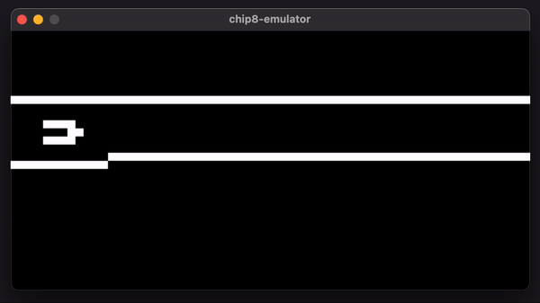

# CHIP8 Emulator

This is my implementation of a CHIP8 **interpreter / virtual machine / emulator**.

It uses C++17 with [libSDL2](https://www.libsdl.org/) for graphics and input.

## Example CHIP8 programs running

The emulator passing tests from the **[chip8 test suite](https://github.com/Timendus/chip8-test-suite)** rom.

**Flight Runner** from johnearnest's [archive](https://johnearnest.github.io/chip8Archive/).

**Br8kout** from johnearnest's [archive](https://johnearnest.github.io/chip8Archive/).
